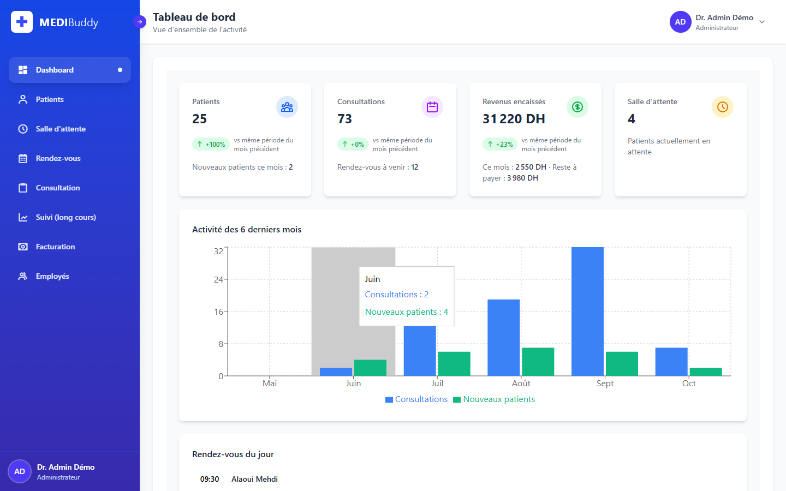
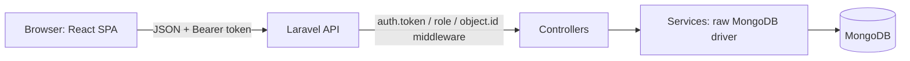
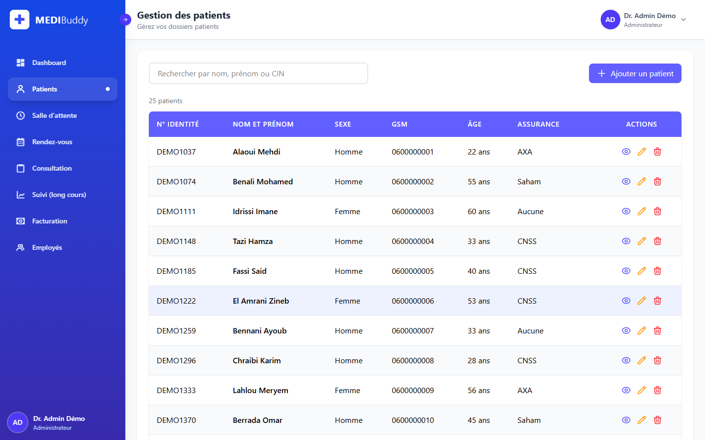
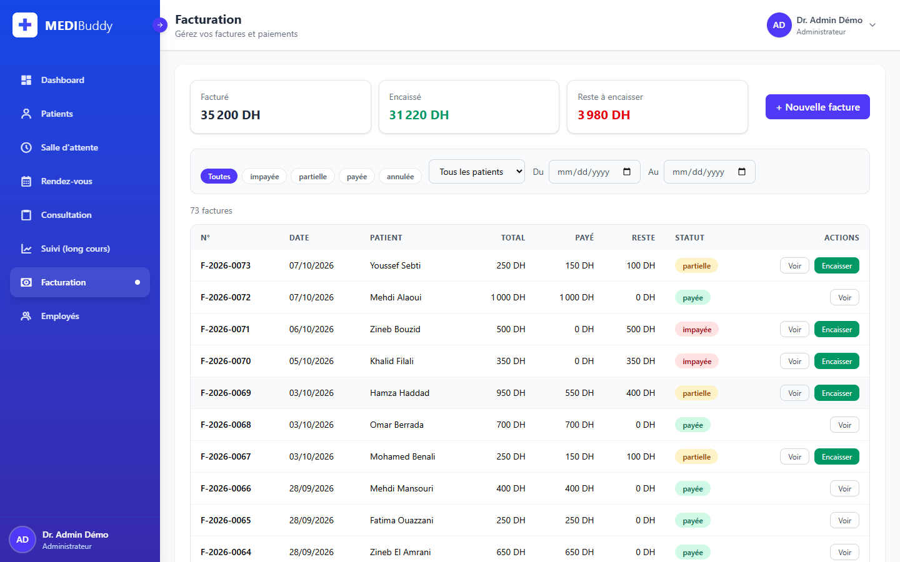
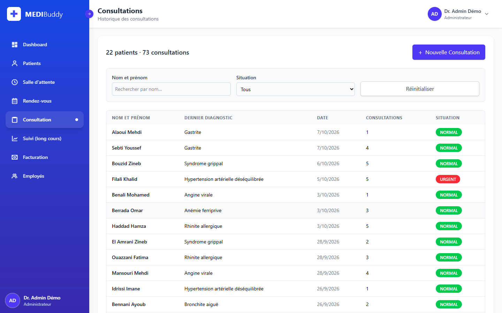
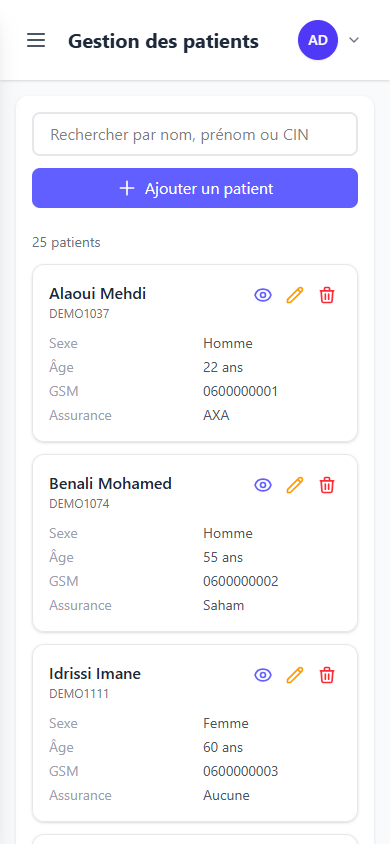

# MEDIBuddy

MEDIBuddy is a practice-management web app for a small medical clinic. Receptionists, nurses and the doctor/administrator work in one place: patient records, the waiting room, appointments, consultations, long-term follow-up, invoices and payments, and a dashboard computed from the real data. It is a full-stack project: a Laravel 12 JSON API on top of MongoDB, and a React 19 single-page app with role-based access.



> All data in the screenshots and in the seed is **fake demo data** (invented names, `DEMO` IDs, `06000000xx` phone numbers).

## Features

**Both roles (administrator and nurse)**
- Dashboard: patients, consultations, upcoming appointments, waiting room and a 6-month activity chart, all computed from the database (no hard-coded figures).
- Patients: search, add, edit, delete (with confirmation), and a patient file with height/weight, BMI (IMC), consultation history and invoices.
- Waiting room: add a patient to the queue, call the next one, take a patient in charge.
- Appointments: book with free-slot detection, appointment history, upcoming and last-past views.
- Consultations: list with filters, details, PDF export (radiology results, treatment plan).
- Follow-up (long-term): read the follow-up history of a patient.
- Billing: invoices with several line items, sequential numbers per year (`F-2026-0001`), partial and full payments by cash/card/cheque/transfer, status chips (unpaid / partial / paid / cancelled), filters, and a PDF per invoice.

**Administrator only**
- Add consultations; add and clear follow-up entries.
- Cancel an invoice (soft cancel with a reason; the invoice is kept).
- Manage the doctors list (add, edit, delete).
- Revenue figures on the dashboard (the nurse dashboard has no revenue card).

The interface is responsive: the sidebar is a drawer below 1024 px and the lists become cards on phones.

## Tech stack

| Part | Technology |
|---|---|
| API | PHP 8.2+ (developed on 8.3), Laravel 12, `mongodb/mongodb` driver with `ext-mongodb` (no Eloquent models) |
| Database | MongoDB (collections: `Patients`, `Factures`, `Employes`, `utilisateur`, `tokens`, `counters`) |
| Frontend | React 19, Vite 7, Tailwind CSS 4, React Router 7, Redux Toolkit (session state), Recharts, jsPDF |
| Tests | PHPUnit feature tests against a separate test database |

## Architecture



- `backend/`: Laravel API. Controllers validate input and return JSON; services talk to MongoDB through the raw driver. `AuthService` issues and checks tokens, `FactureService` owns invoices and the yearly invoice counter.
- `P_v1/`: the React app (the folder name is historical).
  - `src/pages`: one page per route. `src/components`: layout, modals, dialogs, toasts. `src/lib`: API client, auth, permissions (`can(role, action)`), money/date helpers, PDF generators.
  - Routes live under `/app/...`, are lazy-loaded, and are guarded per permission.
- One permissions table (`P_v1/src/lib/permissions.js`) drives the sidebar and the buttons; the server enforces the same rules with route middleware.

## Security

What was hardened (and covered by tests):
- **Authentication**: a random 256-bit token is issued at login; only its SHA-256 is stored in MongoDB (`tokens`), with an expiry (8 h) and a TTL index. Logout deletes it. There is no session cookie.
- **Passwords**: bcrypt only. A plaintext password in the database can never log in; `php artisan medibuddy:hash-passwords` migrates old data.
- **NoSQL injection**: the login (and every input) is validated as plain strings, so payloads such as `{"$ne": ""}` are rejected with 422. A feature test covers it.
- **Authorization**: every route except `POST /api/login` requires a token; `role:admin` / `role:admin,infirmier` middleware per route. Nurses get 403 on admin-only routes (cancelling an invoice, doctors, adding consultations...).
- **Validation**: request bodies are validated and whitelisted (no mass assignment); ObjectId route parameters must match `^[a-f0-9]{24}$` (422 otherwise); invoice totals are computed on the server, and overpayments are refused (with an optimistic lock against double payments).
- **Brute force**: login is throttled (5 failed attempts per minute per IP + login) and costs the same for unknown users as for wrong passwords.
- **CORS**: allowed origins come from `FRONTEND_URL`; credentials are not used.
- **Passwords and tokens are never returned** by the API.

Known limitations (honest list): the token is kept in `localStorage` (an XSS bug could read it; httpOnly cookies would be the next step), and the app is single-tenant (one clinic).

## Local setup

Requirements: PHP 8.2+ with `ext-mongodb` (1.21), Composer, MongoDB (local or Atlas), Node.js 20+.

```bash
# 1. API
cd backend
composer install
cp .env.example .env
php artisan key:generate
# set MONGO_DSN / MONGO_DB / FRONTEND_URL in .env (defaults: mongodb://127.0.0.1:27017, MEDIBuddy, http://localhost:3000)
touch database/database.sqlite        # used by the cache table (login throttling)
php artisan migrate
php artisan medibuddy:seed-demo       # wipes and fills the database with fake demo data
php artisan serve                     # http://127.0.0.1:8000

# 2. Frontend (new terminal)
cd P_v1
npm install
cp .env.example .env                  # VITE_API_URL=http://127.0.0.1:8000/api
npm run dev                           # http://localhost:3000
```

Environment variables:

| Variable | Where | Meaning |
|---|---|---|
| `MONGO_DSN`, `MONGO_DB` | backend | MongoDB connection string and database name |
| `FRONTEND_URL` | backend | allowed browser origin(s), comma-separated (CORS) |
| `APP_KEY`, `APP_ENV`, `APP_DEBUG` | backend | standard Laravel settings (`APP_DEBUG=false` in production) |
| `VITE_API_URL` | frontend | base URL of the API, e.g. `http://127.0.0.1:8000/api` |

`medibuddy:seed-demo` refuses to run when `APP_ENV=production` unless `--force` is given.

### Tests

```bash
cd backend
php artisan test
```

The tests need a running MongoDB; they use a separate database (`MEDIBuddy_test`, set in `phpunit.xml`) that they seed and drop themselves. Currently 60 tests cover login and roles, validation, appointments, consultations, follow-up, invoices and payments, the seed command and the legacy migration.

Frontend production build: `cd P_v1 && npm run build`.

## Demo credentials

After `php artisan medibuddy:seed-demo`:

| Role | Login | Password |
|---|---|---|
| Administrator | `admin@medibuddy.demo` | `Demo1234!` |
| Nurse | `infirmier@medibuddy.demo` | `Demo1234!` |

## Screenshots

| Patients | Billing |
|---|---|
|  |  |

| Consultations | Mobile |
|---|---|
|  |  |

## Roadmap

- Medical certificates and letters (an unfinished draft is kept in `P_v1/src/drafts/Certificats.jsx`).
- Pregnancy follow-up (draft in `P_v1/src/drafts/Grossesse.jsx`).
- Deployment (API with the PHP MongoDB extension, MongoDB Atlas, static frontend).
- Move the token from `localStorage` to an httpOnly cookie.
